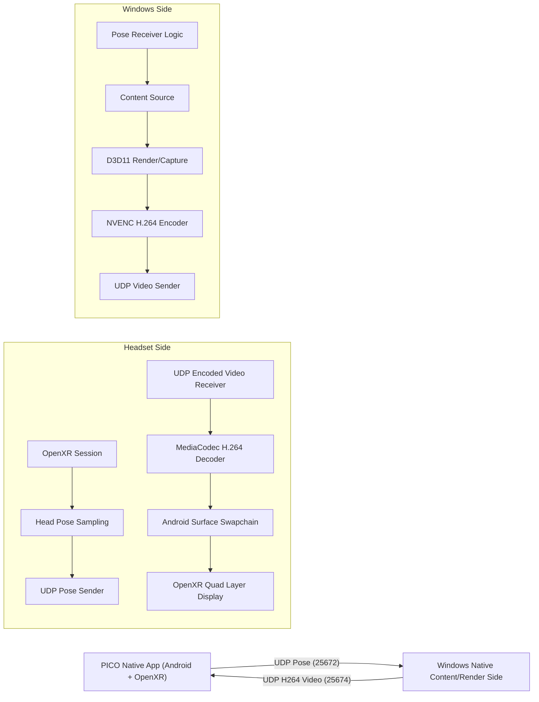
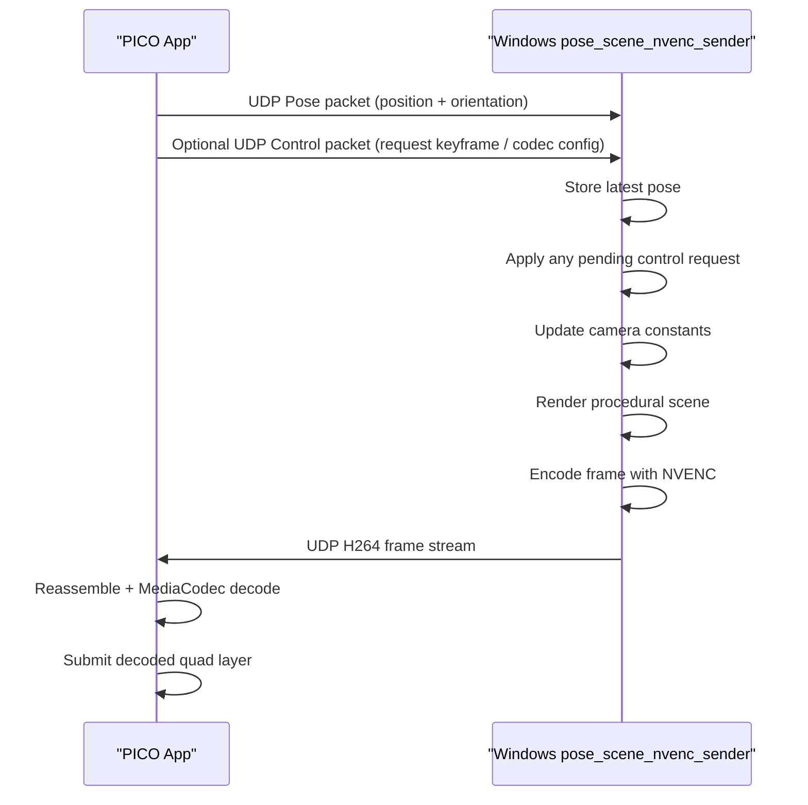
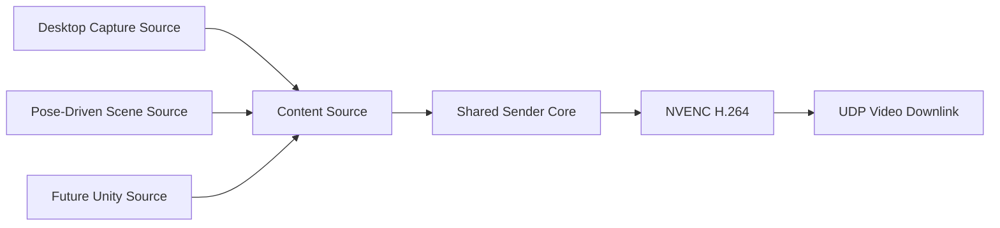

# Current Native VR Interconnect Architecture Guide

> Project workspace: `D:\videotest`  
> Device target: **PICO 4 Ultra**  
> Last updated: 2026-04-10

---

## 1. What this system is now

At the current stage, this project is no longer just a concept or a partial prototype.  
It is now a **working native end-to-end VR interconnect baseline** with a real closed loop:

1. A native Android/OpenXR application runs on **PICO 4 Ultra**
2. The headset sends **head pose** back to the PC over UDP
3. The PC generates or captures content natively on Windows
4. The PC encodes that content with **NVENC H.264**
5. The encoded video is streamed down to the headset over UDP
6. The headset decodes the stream with **MediaCodec**
7. The decoded image is displayed in XR through an **OpenXR quad layer**

And we already have two PC-side content sources:

- **Desktop capture sender**: streams the real Windows desktop
- **Pose-driven scene sender**: renders a native procedural scene whose camera can be driven by headset pose

That means the project already has both:

- a **transport/display baseline**
- and a **true interaction closed loop baseline**

---

## 2. High-level architecture



---

## 3. Design philosophy behind the current implementation

The current system was built with a very deliberate development strategy:

### 3.1 Native first, engine later

We intentionally postponed Unity integration.

Reason:

- Unity is convenient for content
- but it hides too many low-level details during bring-up
- and our first priority was to verify:
  - transport
  - pose timing
  - decoder/display behavior
  - Windows capture/encoding path
  - PICO runtime/session/lifecycle behavior

So the project was split into:

- **Windows Native**
- **Android Native + OpenXR**
- **Unity deferred**

This turned out to be the correct decision, because the most difficult problems were in:

- OpenXR lifecycle
- MediaCodec integration
- Android surface swapchain usage
- desktop capture and low-latency video transport

---

## 4. Current module layout

## 4.1 Windows side

Main directory:

- `D:\videotest\windows-native`

Important sources:

- `D:\videotest\windows-native\src\nvenc_video_sender.cpp`
- `D:\videotest\windows-native\src\desktop_capture_nvenc_sender.cpp`
- `D:\videotest\windows-native\src\pose_scene_nvenc_sender.cpp`
- `D:\videotest\windows-native\src\video_sender_core.cpp`
- `D:\videotest\windows-native\include\video_sender_core.h`
- `D:\videotest\windows-native\src\udp_pose_receiver.cpp`
- `D:\videotest\windows-native\src\mock_pose_sender.cpp`
- `D:\videotest\windows-native\src\mock_video_sender.cpp`

Important build file:

- `D:\videotest\windows-native\CMakeLists.txt`

### Windows executables and their roles

#### 1. `pose_receiver.exe`

Purpose:

- receive and inspect pose uplink packets from headset

Role:

- debugging / validation tool

#### 2. `mock_pose_sender.exe`

Purpose:

- locally simulate pose packets on Windows

Role:

- test a Windows pose-driven renderer without the headset

#### 3. `mock_video_sender.exe`

Purpose:

- send raw RGBA test frames over UDP

Role:

- very early bring-up tool

#### 4. `nvenc_video_sender.exe`

Purpose:

- generate a synthetic moving test pattern
- encode it with NVENC
- stream H.264 to headset

Role:

- encoded-video bring-up tool

#### 5. `desktop_capture_nvenc_sender.exe`

Purpose:

- capture the real Windows desktop
- encode with NVENC
- stream to headset

Role:

- real desktop streaming prototype

#### 6. `pose_scene_nvenc_sender.exe`

Purpose:

- receive pose on UDP
- render a native procedural scene on Windows
- encode and stream it to headset

Role:

- first true **pose-driven closed-loop** demo

---

## 4.2 Android / PICO side

Main directory:

- `D:\videotest\android-native`

Important native sources:

- `D:\videotest\android-native\app\src\main\cpp\openxr_pose_sender.cpp`
- `D:\videotest\android-native\app\src\main\cpp\xr_pose_runtime.cpp`
- `D:\videotest\android-native\app\src\main\cpp\xr_pose_runtime.h`
- `D:\videotest\android-native\app\src\main\cpp\udp_pose_sender.cpp`
- `D:\videotest\android-native\app\src\main\cpp\udp_video_receiver.cpp`
- `D:\videotest\android-native\app\src\main\cpp\udp_encoded_video_receiver.cpp`
- `D:\videotest\android-native\app\src\main\cpp\amedia_h264_decoder.cpp`
- `D:\videotest\android-native\app\src\main\cpp\egl_context.cpp`

Important native build file:

- `D:\videotest\android-native\app\src\main\cpp\CMakeLists.txt`

### Headset-side responsibilities

The headset native app does all of the following:

1. initializes OpenXR runtime
2. creates EGL/OpenGL ES context
3. starts UDP pose sender
4. starts UDP raw video receiver
5. starts UDP encoded video receiver
6. configures MediaCodec when H.264 config arrives
7. renders decoded output into an Android surface swapchain
8. submits that as an OpenXR quad layer

---

## 5. Shared protocol layer

Shared protocol directory:

- `D:\videotest\shared-protocol`

Important files:

- `D:\videotest\shared-protocol\packet_defs.h`
- `D:\videotest\shared-protocol\pose_protocol.h`
- `D:\videotest\shared-protocol\video_protocol.h`
- `D:\videotest\shared-protocol\time_sync.h`

This directory defines the common binary protocol used by both Windows and Android sides.

---

## 6. Current network architecture

## 6.1 Ports

Current default ports:

- **Pose uplink**: `25672`
- **Control uplink**: currently shares the same uplink path / port by default
- **Raw video downlink**: `25673`
- **Encoded H264 video downlink**: `25674`

In current practical usage:

- pose is the main active uplink path
- control now exists as a minimal active uplink path
- encoded H.264 is the main active downlink path

---

## 6.2 Current real network endpoints

Recent observed values during development:

- hotspot session on 2026-04-10:
  - PC IP: `172.20.10.2`
  - PICO IP: `172.20.10.3`

Important note:

- the previous `10.51.x.x` environment was not reliable for live validation
- the hotspot path restored practical protocol connectivity for this project
- actual app-level UDP verification is more meaningful than ICMP alone in this setup

---

## 7. Pose uplink: how it works

## 7.1 Data source on headset

The headset pose comes from OpenXR:

- headset reference space is queried every XR frame
- `xrLocateSpace(...)` is used to obtain position and orientation

The runtime currently uses:

- application space: local
- head space: view

This gives us a pose suitable for low-latency camera-style interaction.

---

## 7.2 Pose packet structure

Pose payload is defined in:

- `D:\videotest\shared-protocol\pose_protocol.h`

Key fields:

- position `(x, y, z)` in meters
- orientation quaternion `(x, y, z, w)`
- tracking flags

Packet structure:

1. generic `PacketHeader`
2. `PosePayload`

The generic header includes:

- magic
- protocol version
- packet type
- payload size
- sequence
- timestamp

---

## 7.3 Pose sender on Android

Main logic lives in:

- `D:\videotest\android-native\app\src\main\cpp\xr_pose_runtime.cpp`
- `D:\videotest\android-native\app\src\main\cpp\udp_pose_sender.cpp`

Runtime flow:

1. `RunFrame()` waits for XR frame
2. predicts display time
3. samples head pose
4. serializes a pose packet
5. sends it by UDP to the configured PC IP

This is important:

- pose is sampled as part of the XR frame loop
- not from a random background timer

That means the pose stream is structurally aligned with XR timing.

---

## 7.4 Pose receiver on Windows

For inspection/debugging:

- `pose_receiver.exe`

Implementation:

- `D:\videotest\windows-native\src\udp_pose_receiver.cpp`

It:

- binds UDP port `25672`
- validates packet header
- parses `PosePayload`
- prints position/orientation
- tracks sequence gaps

For the true closed-loop content source:

- `pose_scene_nvenc_sender.exe`

It contains its own non-blocking UDP pose receive path and keeps the latest pose in memory.

---

## 7.5 Control uplink: what it is and why it exists

Shared protocol file:

- `D:\videotest\shared-protocol\control_protocol.h`

Currently implemented control message types:

- `RequestKeyframe`
- `RequestCodecConfig`

Purpose:

- let the headset ask the PC sender to help recovery when decode/bootstrap state is not ideal

Current implementation strategy:

- control packets reuse the uplink direction
- Android sends control packets through the same UDP sender abstraction currently used for pose
- Windows senders parse control packets and react by:
  - resending codec config
  - forcing a keyframe / IDR

This is the first step toward a real control plane.

---

## 8. Video downlink: how it works

There are two historical video paths:

1. **Raw RGBA path**
2. **Encoded H.264 path**

The raw path was mainly for bring-up and validation.
The encoded H.264 path is now the real working path.

---

## 8.1 Raw RGBA path

This path was used to prove:

- network packetization
- UDP reassembly
- basic XR quad display

Windows:

- `mock_video_sender.exe`

Android:

- `udp_video_receiver.cpp`

Format:

- RGBA8888
- split into UDP chunks

This path is now mostly a diagnostic fallback.

---

## 8.2 Encoded H.264 path

This is the main path now.

Windows:

- `nvenc_video_sender.exe`
- `desktop_capture_nvenc_sender.exe`
- `pose_scene_nvenc_sender.exe`

Android:

- `udp_encoded_video_receiver.cpp`
- `amedia_h264_decoder.cpp`

Protocol:

- H.264 Annex B
- video access units split into UDP chunks

Important protocol definitions:

- `VideoCodec::H264AnnexB`
- `EncodedVideoChunkHeader`
- `VideoFrameFlagCodecConfig`
- `VideoFrameFlagKeyframe`

All encoded video packets still use the same generic packet header first.

---

## 8.3 Why UDP is used right now

Current use of UDP is intentional.

Reason:

- low integration cost
- predictable binary protocol
- easy bring-up
- easy logging and debugging

Tradeoff:

- no built-in congestion control
- no reliable retransmission
- no pacing logic
- no NAT traversal / session abstraction

So UDP is appropriate for the current **systems prototype stage**, but not yet the final transport architecture.

---

## 9. Windows encoding side in detail

## 9.1 Encoder backend

All current encoded senders use:

- D3D11
- NVIDIA NVENC
- NVIDIA sample wrapper from Video Codec SDK

Main dependency directory:

- `D:\videotest\third_party\nvidia-video-sdk-samples\video-sdk-samples-master`

Important reused files:

- `NvEncoder.cpp`
- `NvEncoderD3D11.cpp`

This choice gave us a fast way to get a real hardware encoder path working.

---

## 9.2 Current sender classes by content source

### Shared sender core

`video_sender_core.cpp` + `video_sender_core.h`

What it does:

1. owns the common UDP video socket path
2. initializes NVENC
3. sends startup codec config
4. applies keyframe / codec-config control requests
5. packetizes H.264 access units into the shared video protocol

Why it matters:

- this is the first step toward making Windows content sources truly pluggable
- desktop capture and pose-scene senders now share one encode/send loop
- Unity can later integrate as another content source that only needs to supply a D3D11 texture

---

### A. Synthetic sender

`nvenc_video_sender.cpp`

What it does:

- builds a moving procedural test image on PC
- uploads BGRA frame into D3D11 texture
- encodes with NVENC
- sends H.264

Usefulness:

- removes complexity from capture
- isolates transport and decode

---

### B. Desktop capture sender

`desktop_capture_nvenc_sender.cpp`

What it does now:

1. uses **DXGI Desktop Duplication**
2. captures desktop into GPU texture
3. runs a GPU scaling pass
4. preserves aspect ratio
5. copies scaled frame into NVENC input
6. sends encoded H.264

Important architectural evolution:

#### Earlier version

- GPU capture
- CPU readback
- CPU resize
- GPU upload to encoder

#### Current optimized version

- GPU capture
- GPU scaling
- GPU copy to encoder

This reduced:

- latency
- CPU work
- scaling artifacts

---

### C. Pose-driven scene sender

`pose_scene_nvenc_sender.cpp`

What it does:

1. listens for pose on UDP
2. stores latest pose
3. renders a procedural scene each frame
4. uses pose as camera state
5. encodes result with NVENC
6. streams to headset

This sender is currently the best demonstration of a true closed loop.

---

## 10. Windows pose-driven scene sender in detail

This is worth explaining carefully because it represents the current “interactive system” architecture.

## 10.1 Why we chose a procedural shader scene

We did **not** jump directly to Unity or a large renderer.

Instead we used a procedural D3D11 scene because:

- it keeps the dependency graph small
- it is easy to verify pose responsiveness
- it is deterministic
- it is fully native
- it is sufficient to prove:
  - pose receive
  - camera update
  - rendering
  - encoding
  - transport
  - headset display

This was the correct engineering tradeoff for the stage we are in.

---

## 10.2 How the scene is rendered

The sender creates:

- a D3D11 render target texture
- a fullscreen-triangle render pass
- a constant buffer containing camera state

The pixel shader procedurally computes:

- sky
- floor grid
- colored spheres

There is no mesh loader and no engine scene graph yet.
The scene is mostly “raymarch / ray-intersect style procedural shading” in a fullscreen shader.

This is computationally lightweight and visually good enough to see camera motion.

---

## 10.3 How pose drives the camera

Latest pose packet gives:

- camera position
- camera orientation quaternion

On Windows side:

1. quaternion is normalized
2. quaternion is converted to 3 rotation rows
3. these rows are written into a shader constant buffer
4. the pixel shader uses them to rotate the camera ray

So the chain is:

```text
UDP pose packet
-> latest pose state
-> quaternion to rotation basis
-> shader constant buffer
-> ray direction update
-> rendered frame changes
```

This is the actual closed-loop interaction mechanism.

---

## 10.4 Why local procedural rendering matters

This is the first sender where:

- the **content itself** depends on pose
- not just the display pipeline

That distinction is important.

Desktop streaming proves transport.
Pose-driven scene streaming proves interaction.

---

## 11. Android headset-side implementation details

## 11.1 App model

The headset app is based on:

- `NativeActivity`
- `android_native_app_glue`

Entry point:

- `openxr_pose_sender.cpp`

This app is not a Java UI app in the usual sense.  
It is a native XR runtime app.

---

## 11.2 OpenXR initialization path

Important runtime file:

- `xr_pose_runtime.cpp`

Initialization includes:

- OpenXR loader init for Android
- OpenXR instance creation
- extension checks
- system selection
- EGL context init
- OpenGL ES graphics binding
- session creation
- reference spaces
- quad swapchain
- Android surface swapchain

Important enabled OpenXR extensions include:

- `XR_KHR_android_create_instance`
- `XR_KHR_opengl_es_enable`
- `XR_KHR_android_surface_swapchain`
- `XR_FB_swapchain_update_state`
- `XR_FB_swapchain_update_state_android_surface`

These are critical to the current display path.

---

## 11.3 Why the app originally got stuck in loading

A key issue during development was:

- the app would launch
- but not become a visible XR scene

Cause:

- no meaningful visible composition layer was being submitted

Fix:

- create a minimal quad swapchain
- always have something renderable to submit

This became the foundation for both the early raw-video path and the later decoded-video path.

---

## 11.4 Encoded video receive path on Android

Files:

- `udp_encoded_video_receiver.h`
- `udp_encoded_video_receiver.cpp`

Responsibilities:

- bind UDP port `25674`
- receive chunked H.264 packets
- validate headers
- reassemble full encoded frame
- queue completed encoded frames for decoder consumption

This code works at the packet assembly layer only.
It does not decode by itself.

---

## 11.5 MediaCodec integration

Files:

- `amedia_h264_decoder.h`
- `amedia_h264_decoder.cpp`

Responsibilities:

- accept codec config frame
- extract SPS/PPS from Annex B
- configure `AMediaCodec` for `video/avc`
- queue encoded access units
- drain output
- release output buffers for render
- request control actions when decode/bootstrap conditions suggest resynchronization is needed

Important point:

This is now verified to actually produce real rendered output frames.
We are no longer just “configuring” the decoder; it is genuinely decoding and displaying.

---

## 11.6 Why Android surface swapchain is used

Decoded output is not copied manually into a GL texture in the current main path.

Instead:

- an Android surface swapchain is created through OpenXR extensions
- MediaCodec renders directly to that surface
- that surface-backed swapchain is submitted in an OpenXR quad layer

This is elegant because it avoids:

- writing a custom `SurfaceTexture + OES + blit` pipeline immediately

But it required careful debugging to make stable.

---

## 11.7 OpenXR display submission logic

At runtime:

- if decoded video has rendered at least one frame,
  - submit the Android surface swapchain in a quad layer
- otherwise
  - fallback to the basic internal quad layer

This is why the headset app can still remain visible while waiting for the encoded path.

---

## 12. Closed-loop behavior today

At this exact moment, the full interaction loop works like this:



That is the current interactive system in one loop.

---

## 13. Build and run commands

## 13.1 Windows build

```powershell
C:\Program Files\CMake\bin\cmake.exe --build D:\videotest\windows-native\build --config Debug
```

## 13.2 Android build

```powershell
D:\videotest\android-native\gradlew.bat assembleDebug --console plain
```

## 13.3 Android install

```powershell
D:\platform-tools-latest-windows\platform-tools\adb.exe install -r D:\videotest\android-native\app\build\outputs\apk\debug\app-debug.apk
```

## 13.4 Start headset app

```powershell
D:\platform-tools-latest-windows\platform-tools\adb.exe shell am start -n com.videotest.nativeapp/android.app.NativeActivity
```

## 13.4.1 Start headset app with explicit runtime config

```powershell
D:\platform-tools-latest-windows\platform-tools\adb.exe shell am force-stop com.videotest.nativeapp
D:\platform-tools-latest-windows\platform-tools\adb.exe shell am start -n com.videotest.nativeapp/android.app.NativeActivity --es target_host 172.20.10.2 --ei target_port 25672 --ei video_port 25673 --ei encoded_video_port 25674
```

Behavior:

- `Intent` extras override the current defaults
- if no extras are provided, the app now attempts to reuse the last successful saved runtime config

## 13.5 Real desktop streaming

```powershell
D:\videotest\windows-native\build\Debug\desktop_capture_nvenc_sender.exe 10.51.101.88 25674 10 5000000 0 1280 720
```

## 13.6 Pose-driven scene closed-loop sender

```powershell
D:\videotest\windows-native\build\Debug\pose_scene_nvenc_sender.exe 10.51.101.88 25674 1280 720 15 4000000 25672
```

Argument order:

```text
<headset_ip> <video_port> <width> <height> <fps> <bitrate> <pose_port>
```

---

## 14. Current strengths of the architecture

The current architecture is strong in several ways:

### 14.1 It is truly native

- Windows side is native
- Android side is native
- pose path is native
- video path is native
- XR display is native

### 14.2 It is modular

Different content sources can be swapped without rewriting the headset app:

- synthetic sender
- desktop sender
- pose-driven scene sender
- later Unity sender

### 14.3 It is debuggable

Because protocol and components are explicit, we can isolate problems at:

- UDP receive
- packet reassembly
- decoder config
- output render
- XR submission
- pose uplink
- Windows content generation

### 14.4 It already supports future integration

The current structure makes it straightforward to add:

- control channel
- bitrate adaptation
- Unity source
- WebRTC transport
- alternate capture backends

---

## 15. Current limitations

Even though the system works, it is not “finished”.

### 15.1 Transport is still prototype-grade

- UDP only
- no congestion control
- no retransmit
- no session management

### 15.2 Pose and video are not yet tightly time-synchronized

- pose has timestamps
- video has timestamps
- but there is no full motion-to-photon synchronization strategy yet

### 15.3 Control channel exists, but is still minimal

We now have a dedicated minimal control protocol for:

- request keyframe
- request codec config

But we still do **not** yet have:

- bitrate change
- pause/resume
- transport state feedback
- acknowledgements / resend semantics

### 15.4 Unity is not yet integrated

This is intentional, but still a limitation for content complexity.

### 15.5 Firewall / deployment ergonomics are still raw

For example:

- a new Windows executable may need explicit inbound firewall permission for pose UDP

---

## 16. Why the architecture is in a good place now

At this stage, the project has reached a very valuable point:

- transport proved
- decode/display proved
- desktop capture proved
- latency improved
- pose-driven content proved
- real interaction closed loop proved

This means future work can now focus on:

- optimization
- robustness
- productization
- content source upgrades

rather than on basic feasibility.

---

## 17. Recommended next evolution paths

## Path A: Productize the native closed loop

Good next tasks:

- add control channel
- keyframe/config resync requests
- bitrate adaptation
- better telemetry
- better startup/recovery behavior

## Path B: Upgrade content source

Possible next tasks:

- integrate Unity as a pluggable content source
- feed Unity render result into encoder
- compare Unity output path vs native scene path

## Path C: Upgrade transport

Possible next tasks:

- add a WebRTC path
- compare latency/reliability against current UDP prototype

---

## 18. One-sentence summary

The current architecture is a **native Windows ↔ native PICO/OpenXR streaming system** where the headset sends pose upward, the PC generates or captures content, the PC hardware-encodes it with NVENC, and the headset decodes/displays it through MediaCodec + OpenXR, with a working pose-driven closed loop already demonstrated.
---

## 19. Latest Practical Status (2026-04-09)

### 19.1 What is technically in place now

- Android side has:
  - pose uplink
  - minimal control uplink
  - encoded video downlink
  - MediaCodec decode
  - OpenXR quad-layer display
- Windows side has:
  - shared sender core
  - desktop-capture content source
  - pose-driven procedural-scene content source

### 19.2 What the new Windows split looks like



In practice this means:

- content generation is now decoupled from transport/encode
- Unity integration no longer needs to copy sender logic from existing executables
- the next Windows-side task can focus on supplying textures instead of rebuilding the network path

### 19.3 Current live-test status

The previous LAN/runtime blocker has now been cleared for active development by using a hotspot path.

Validated state on 2026-04-10:

- the app reaches active OpenXR session state `5`
- the app is in the resumed/focused foreground path
- pose uplink reaches Windows successfully
- H.264 downlink reaches Android successfully
- `MediaCodec` renders output again on the headset
- the pose-driven native scene sender is again operating in `pose=active` mode

The current practical rule is still:

- verify target IPs every time the hotspot/network changes
- verify actual headset foreground state before blaming the transport
- prefer protocol-level validation over ICMP alone when testing this stack

### 19.4 Current Android config model

The headset app no longer relies on editing and rebuilding a hard-coded PC IP for every network change.

Current precedence is:

1. built-in defaults
2. last successful persisted runtime config
3. explicit `Intent` overrides

The persisted config is saved only after the first decoded frame is actually rendered, which makes it a practical "last known good" endpoint rather than merely the last attempted one.

### 19.5 Current Unity integration status

Unity is no longer only a planned future content source. The repository now contains a first-pass Windows native plugin scaffold for Unity:

- `D:\videotest\windows-native\src\unity_sender_plugin.cpp`
- `D:\videotest\windows-native\include\unity_sender_plugin.h`
- `D:\videotest\unity-integration\README.md`
- `D:\videotest\unity-integration\UnitySenderPluginBindings.cs`

This plugin currently assumes:

- Windows
- Unity renderer = D3D11
- fixed-size `RenderTexture` during streaming

Its architecture is:

1. Unity render thread copies the `RenderTexture` into a plugin-owned D3D11 texture
2. a Windows network thread receives pose/control
3. a sender thread reuses the shared NVENC sender core

This is the intended bridge between:

- Unity content production
- existing native Windows encode/transport stack
