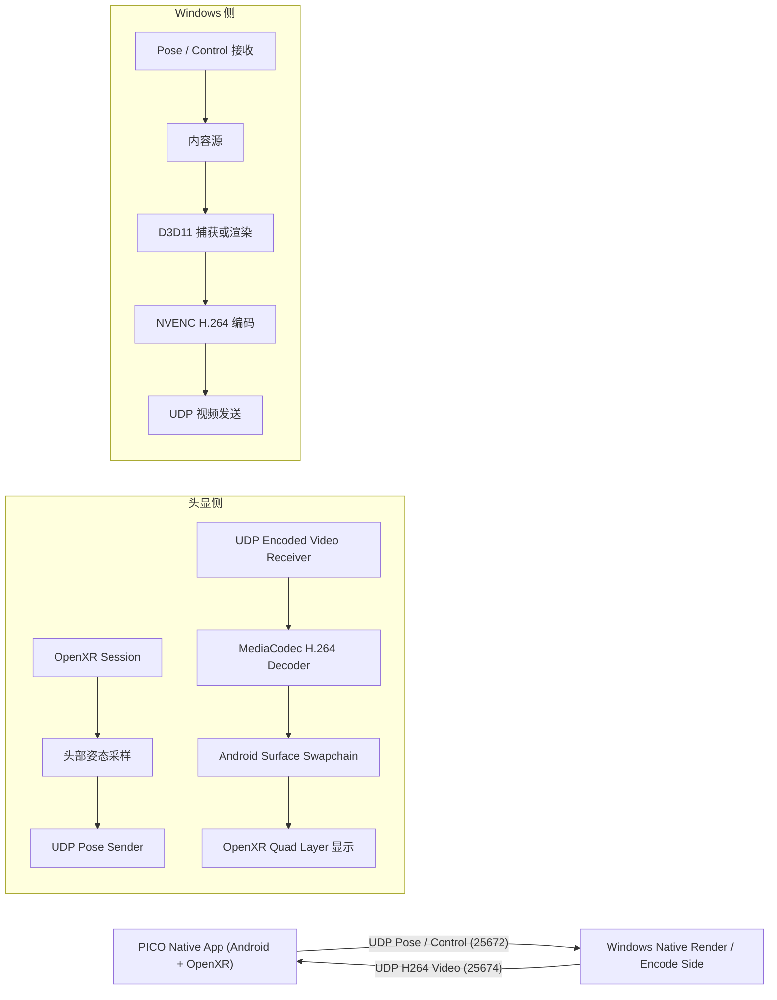
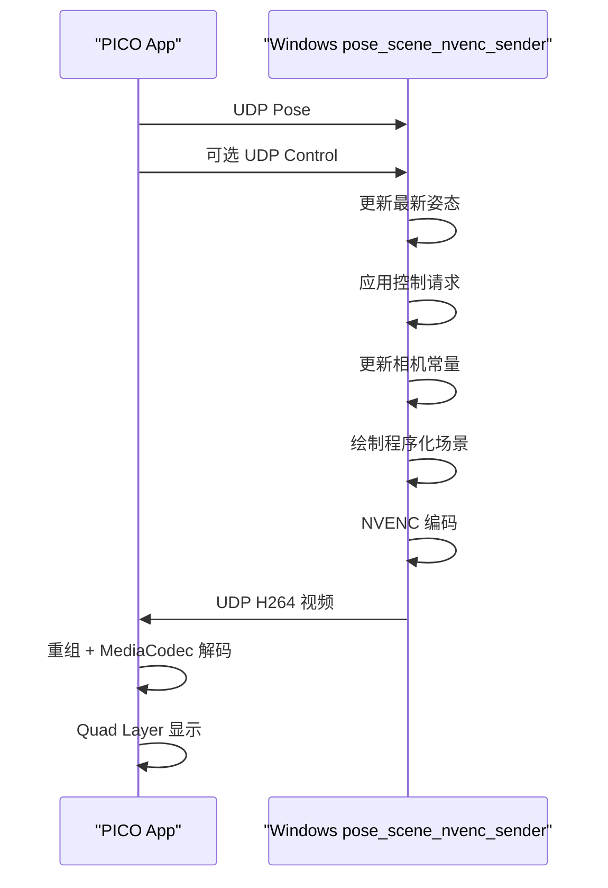
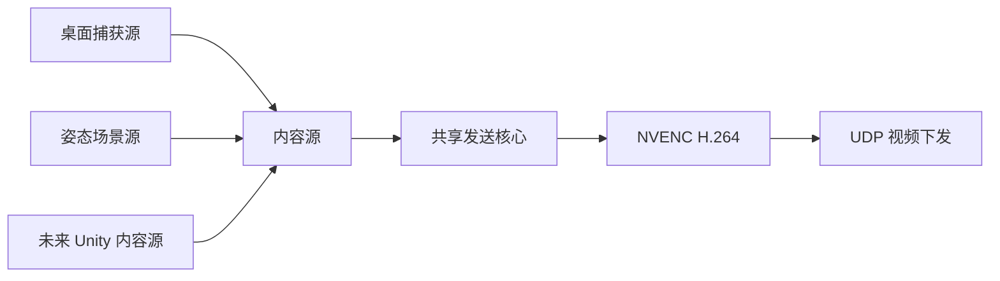

# 当前原生 VR 互联系统架构说明（中文版）

> 项目工作区：`D:\videotest`  
> 目标设备：**PICO 4 Ultra**  
> 更新时间：2026-04-10

---

## 1. 当前系统已经是什么

到目前为止，这个项目已经不再只是“想法”或“半成品 Demo”，而是一套已经完成核心闭环验证的 **原生端到端 VR 互联系统基线**。

当前已经跑通的主链路是：

1. PICO 4 Ultra 上运行一个原生 Android/OpenXR 应用
2. 头显把头部姿态通过 UDP 回传给 Windows
3. Windows 原生侧生成或捕获内容
4. Windows 侧用 NVENC 将内容编码为 H.264
5. 编码视频通过 UDP 下发给头显
6. 头显用 MediaCodec 解码
7. 解码结果通过 OpenXR quad layer 显示在 XR 中

当前 PC 端已经存在两种内容来源：

- **桌面捕获 sender**
  采集真实 Windows 桌面并下发

- **姿态驱动的原生场景 sender**
  在 Windows 原生侧绘制一个程序化场景，并用头显姿态驱动相机

这意味着系统已经同时具备：

- 一条可工作的 **传输与显示基线**
- 一条可工作的 **姿态驱动交互闭环**

---

## 2. 高层架构



---

## 3. 当前设计哲学

### 3.1 先原生，后 Unity

项目一开始刻意没有直接上 Unity 双端，也没有急着做产品级外壳，而是先把这些问题逐个搞清楚：

- PICO 上原生 OpenXR 是否稳定
- 姿态上行是否可靠
- 视频下行是否稳定
- Android MediaCodec 和 OpenXR 显示层如何协作
- Windows 端如何用 D3D11 + NVENC 建立低层链路

这是正确的工程顺序，因为真正的风险不在“做不做一个场景”，而在：

- OpenXR 生命周期
- MediaCodec 集成
- Android surface swapchain
- Windows 捕获与编码路径
- 网络与解码恢复

### 3.2 内容与传输分离

最近一次重构后，Windows 端已经明确拆成两层：

1. **内容源**
   负责提供一张 D3D11 纹理

2. **共享发送核心**
   负责编码、关键帧策略、SPS/PPS、H.264 分片和 UDP 发送

这一步是为后续 Unity 接入做准备。Unity 以后不需要重写发送逻辑，只需要作为一种新的内容源接到共享发送核心上。

---

## 4. 当前模块布局

## 4.1 Windows 侧

主目录：

- `D:\videotest\windows-native`

重要源文件：

- `D:\videotest\windows-native\src\nvenc_video_sender.cpp`
- `D:\videotest\windows-native\src\desktop_capture_nvenc_sender.cpp`
- `D:\videotest\windows-native\src\pose_scene_nvenc_sender.cpp`
- `D:\videotest\windows-native\src\video_sender_core.cpp`
- `D:\videotest\windows-native\include\video_sender_core.h`
- `D:\videotest\windows-native\src\udp_pose_receiver.cpp`
- `D:\videotest\windows-native\src\mock_pose_sender.cpp`
- `D:\videotest\windows-native\src\mock_video_sender.cpp`

构建文件：

- `D:\videotest\windows-native\CMakeLists.txt`

### 当前可执行程序及用途

#### 1. `pose_receiver.exe`

用途：

- 接收并打印头显姿态包
- 用于姿态链路调试

#### 2. `mock_pose_sender.exe`

用途：

- 在 Windows 本地模拟姿态上行
- 用于在没有头显时验证姿态驱动逻辑

#### 3. `mock_video_sender.exe`

用途：

- 发送原始 RGBA 测试图像
- 属于很早期的 bring-up 工具

#### 4. `nvenc_video_sender.exe`

用途：

- 生成简单测试图像
- 用 NVENC 编码
- 将 H.264 发送到头显

#### 5. `desktop_capture_nvenc_sender.exe`

用途：

- 捕获真实 Windows 桌面
- 编码并下发

#### 6. `pose_scene_nvenc_sender.exe`

用途：

- 接收头显姿态
- 在 Windows 原生侧绘制程序化场景
- 编码并下发

它是当前“真正交互闭环”的最佳示例。

---

## 4.2 Android / PICO 侧

主目录：

- `D:\videotest\android-native`

重要源文件：

- `D:\videotest\android-native\app\src\main\cpp\openxr_pose_sender.cpp`
- `D:\videotest\android-native\app\src\main\cpp\xr_pose_runtime.cpp`
- `D:\videotest\android-native\app\src\main\cpp\xr_pose_runtime.h`
- `D:\videotest\android-native\app\src\main\cpp\runtime_config_store.cpp`
- `D:\videotest\android-native\app\src\main\cpp\runtime_config_store.h`
- `D:\videotest\android-native\app\src\main\cpp\udp_pose_sender.cpp`
- `D:\videotest\android-native\app\src\main\cpp\udp_encoded_video_receiver.cpp`
- `D:\videotest\android-native\app\src\main\cpp\amedia_h264_decoder.cpp`
- `D:\videotest\android-native\app\src\main\cpp\egl_context.cpp`

头显端负责：

1. 初始化 OpenXR
2. 初始化 EGL / OpenGL ES
3. 采样头显姿态
4. 发送 pose / control 上行
5. 接收编码视频
6. 用 MediaCodec 解码
7. 将输出挂到 Android surface swapchain
8. 以 OpenXR quad layer 的方式显示

---

## 5. 共享协议层

共享协议目录：

- `D:\videotest\shared-protocol`

关键文件：

- `D:\videotest\shared-protocol\packet_defs.h`
- `D:\videotest\shared-protocol\pose_protocol.h`
- `D:\videotest\shared-protocol\video_protocol.h`
- `D:\videotest\shared-protocol\control_protocol.h`
- `D:\videotest\shared-protocol\time_sync.h`

作用：

- 给 Windows 和 Android 两端定义统一的二进制协议
- 保证 packet header、pose、video、control 的字段对齐一致

---

## 6. 当前网络架构

## 6.1 默认端口

当前默认端口如下：

- **Pose / Control 上行**：`25672`
- **原始视频下行**：`25673`
- **编码 H.264 视频下行**：`25674`

在当前实际使用中：

- `25672` 是主要上行口
- `25674` 是主要下行口
- `25673` 主要保留给历史/诊断路径

## 6.2 当前开发网络的实际情况

最近一次有效联调是在手机热点下完成的，观察到的地址为：

- PC：`172.20.10.2`
- PICO 4 Ultra：`172.20.10.3`

这里有一个非常重要的经验：

- ICMP `ping` 结果不一定等价于应用协议结果
- 在某些环境里，`头显 -> PC` 的 `ping` 可能失败，但 UDP 应用流量依然能正常上行

所以当前项目联调时，**应优先相信协议级日志，而不是只看 ping**。

---

## 7. 姿态上行链路

## 7.1 姿态来源

头显姿态来自 OpenXR：

- 头显端在 XR frame loop 中调用 `xrLocateSpace(...)`
- 读取头部位置与旋转
- 在 Native 层构造成 `PosePayload`

当前使用的空间大致为：

- 应用空间：`local`
- 头部空间：`view`

这适合做低延迟视角驱动。

## 7.2 姿态包结构

姿态 payload 定义于：

- `D:\videotest\shared-protocol\pose_protocol.h`

关键字段包括：

- 位置 `(x, y, z)`，单位为米
- 四元数 `(x, y, z, w)`
- tracking flags

完整包结构为：

1. 通用 `PacketHeader`
2. `PosePayload`

其中通用头包含：

- magic
- protocol version
- packet type
- payload size
- sequence
- timestamp

## 7.3 Android 端 Pose Sender

主逻辑位于：

- `D:\videotest\android-native\app\src\main\cpp\xr_pose_runtime.cpp`
- `D:\videotest\android-native\app\src\main\cpp\udp_pose_sender.cpp`

运行流程：

1. 等待 XR 帧
2. 预测显示时间
3. 采样头部姿态
4. 序列化 pose packet
5. 通过 UDP 发给配置中的 Windows IP

姿态采样是绑定在 XR frame loop 中完成的，不是一个随意的后台定时器。这意味着其时间语义和 XR 运行时更一致。

## 7.4 Windows 端 Pose Receiver

独立调试工具：

- `pose_receiver.exe`

核心逻辑：

- 绑定 `25672`
- 校验包头
- 解析 `PosePayload`
- 输出 position / quaternion / sequence

用于闭环内容驱动时，`pose_scene_nvenc_sender` 也会在内部维护自己的最新姿态状态。

## 7.5 控制上行

控制协议定义于：

- `D:\videotest\shared-protocol\control_protocol.h`

当前已实现的控制消息：

- `RequestKeyframe`
- `RequestCodecConfig`

它们的作用是：

- 让头显在解码恢复或晚加入场景时向 PC sender 请求帮助

当前策略：

- Android 端复用姿态上行的 UDP sender 抽象发送 control
- Windows sender 收到后可：
  - 重发 codec config
  - 强制下一帧为 IDR / keyframe

---

## 8. 视频下行链路

## 8.1 原始 RGBA 路径

这条路径是早期 bring-up 用的，主要用于验证：

- UDP 分片
- 接收端重组
- Quad layer 显示

Windows 端工具：

- `mock_video_sender.exe`

Android 端：

- `udp_video_receiver.cpp`

现在这条路径已经不是主链路，但仍然有诊断价值。

## 8.2 编码 H.264 路径

这是当前真正使用的主链路。

Windows 端：

- `nvenc_video_sender.exe`
- `desktop_capture_nvenc_sender.exe`
- `pose_scene_nvenc_sender.exe`

Android 端：

- `udp_encoded_video_receiver.cpp`
- `amedia_h264_decoder.cpp`

协议层定义：

- `VideoCodec::H264AnnexB`
- `EncodedVideoChunkHeader`
- `VideoFrameFlagCodecConfig`
- `VideoFrameFlagKeyframe`

所有视频包前面仍然带统一的 `PacketHeader`。

## 8.3 为什么当前仍然用 UDP

当前用 UDP 是一个非常明确的工程选择，因为它：

- 集成成本低
- 二进制协议清晰
- 容易打日志
- 容易在 bring-up 阶段定位问题

它的代价也很明显：

- 没有拥塞控制
- 没有可靠重传
- 没有 NAT 穿透
- 没有 session 层

因此 UDP 适合作为当前的 **系统原型阶段传输**，但不是最终产品形态。

---

## 9. Windows 编码侧细节

## 9.1 编码后端

当前编码 sender 都基于：

- D3D11
- NVIDIA NVENC
- NVIDIA Video Codec SDK sample wrapper

依赖目录：

- `D:\videotest\third_party\nvidia-video-sdk-samples\video-sdk-samples-master`

## 9.2 共享发送核心

Windows 侧现在已经引入共享发送核心：

- `D:\videotest\windows-native\src\video_sender_core.cpp`
- `D:\videotest\windows-native\include\video_sender_core.h`

它负责：

1. 管理 UDP 视频发送 socket
2. 初始化 NVENC
3. 发送 startup codec config
4. 处理 keyframe / codec-config 控制请求
5. 把 H.264 access unit 分片为视频包

它的意义在于：

- 桌面捕获 sender 和姿态场景 sender 不再各自复制一整套编码和发送逻辑
- 未来 Unity 也可以只作为新的内容源接入

## 9.3 桌面捕获 sender

`desktop_capture_nvenc_sender.cpp`

当前做法：

1. 使用 **DXGI Desktop Duplication**
2. 捕获桌面到 GPU 纹理
3. 用一个 D3D11 shader pass 做缩放
4. 保持纵横比，必要时补边
5. 复制到 NVENC 输入纹理
6. 编码并下发

这条路径相比早期 CPU 中转版已经更低延迟、更省 CPU。

## 9.4 姿态驱动原生场景 sender

`pose_scene_nvenc_sender.cpp`

当前做法：

1. 监听姿态上行
2. 维护最新 pose
3. 在 D3D11 中绘制程序化场景
4. 把 pose 作为相机状态
5. 编码并下发

这是当前闭环验证最关键的 Windows 端路径。

---

## 10. 姿态驱动原生场景的实现思路

我们没有一开始就接 Unity，而是先在 D3D11 里做了一个程序化场景。

原因：

- 依赖少
- 逻辑可控
- 更适合验证姿态闭环
- 不会把问题藏在引擎里

其渲染思路是：

- 绘制一个 fullscreen triangle
- 在 pixel shader 中根据相机射线计算地面、天空和简单几何体
- 把头显四元数转为旋转基
- 通过 constant buffer 传入 shader

这样一来，姿态到画面的变换链路就是：

```text
UDP pose
-> 最新姿态状态
-> 四元数转旋转矩阵
-> constant buffer
-> shader 中的相机射线变化
-> 最终画面变化
```

这是真正意义上的“交互闭环”，而不只是桌面视频传输。

---

## 11. Android 头显端实现细节

## 11.1 应用模型

当前头显端基于：

- `NativeActivity`
- `android_native_app_glue`

入口文件：

- `openxr_pose_sender.cpp`

这是一个原生 XR 应用，而不是传统 Java UI App。

## 11.2 OpenXR 初始化

主要逻辑在：

- `xr_pose_runtime.cpp`

初始化流程包括：

- OpenXR loader 初始化
- instance 创建
- extension 检查
- system 选择
- EGL 初始化
- OpenGL ES graphics binding
- session 创建
- reference space 创建
- quad swapchain 创建
- Android surface swapchain 创建

关键扩展包含：

- `XR_KHR_android_create_instance`
- `XR_KHR_opengl_es_enable`
- `XR_KHR_android_surface_swapchain`
- `XR_FB_swapchain_update_state`
- `XR_FB_swapchain_update_state_android_surface`

## 11.3 编码视频接收

主要文件：

- `udp_encoded_video_receiver.cpp`

职责：

- 监听 `25674`
- 接收分片视频包
- 重组完整的 H.264 frame
- 放入解码队列

## 11.4 MediaCodec 解码

主要文件：

- `amedia_h264_decoder.cpp`

职责：

- 接收 codec config frame
- 提取 SPS / PPS
- 配置 `video/avc`
- 推送编码帧到 decoder
- drain output
- 渲染输出
- 在需要时触发控制请求

当前这条路径已经实机验证过，不只是“成功配置 decoder”，而是确实已经渲染出第一帧，并在 OpenXR 中可见。

## 11.5 Android surface swapchain 显示路径

当前没有走“先解码到 SurfaceTexture，再手动拷贝进 GL texture”的复杂路径，而是：

- 通过 OpenXR 扩展创建 Android surface swapchain
- MediaCodec 直接向该 surface 输出
- 将其作为 OpenXR quad layer 的显示来源

这条路径的优点是：

- 少一道中间拷贝
- 渲染链路更直

但它也需要更仔细地处理 Android / JNI / OpenXR 生命周期。

---

## 12. 当前闭环行为



这就是当前已经被验证过的交互闭环。

---

## 13. 构建与运行

## 13.1 Windows 构建

```powershell
C:\Program Files\CMake\bin\cmake.exe --build D:\videotest\windows-native\build --config Debug
```

## 13.2 Android 构建

```powershell
D:\videotest\android-native\gradlew.bat assembleDebug --console plain
```

## 13.3 安装 APK

```powershell
adb install -r D:\videotest\android-native\app\build\outputs\apk\debug\app-debug.apk
```

## 13.4 启动头显应用

```powershell
adb shell am force-stop com.videotest.nativeapp
adb shell am start -n com.videotest.nativeapp/android.app.NativeActivity
```

## 13.5 使用显式运行时配置启动

```powershell
adb shell am force-stop com.videotest.nativeapp
adb shell am start -n com.videotest.nativeapp/android.app.NativeActivity --es target_host 172.20.10.2 --ei target_port 25672 --ei video_port 25673 --ei encoded_video_port 25674
```

说明：

- 现在 Android 端不再要求每次改源码重编 APK
- `Intent` 参数会覆盖默认值
- 如果不传参数，应用会尝试读取“上次成功配置”

## 13.6 桌面 sender

```powershell
D:\videotest\windows-native\build\Debug\desktop_capture_nvenc_sender.exe 172.20.10.3 25674 10 4000000 0 1280 720 25672
```

## 13.7 姿态场景 sender

```powershell
D:\videotest\windows-native\build\Debug\pose_scene_nvenc_sender.exe 172.20.10.3 25674 1280 720 15 4000000 25672
```

---

## 14. 当前架构的优势

### 14.1 真正原生

- Windows 原生
- Android 原生
- OpenXR 原生
- NVENC 原生
- MediaCodec 原生

### 14.2 模块边界清晰

内容源、编码发送、姿态上行、解码显示分层明确，便于替换和扩展。

### 14.3 可调试性强

因为协议显式、路径显式，所以问题可以精确定位到：

- UDP 收发
- 分片重组
- decoder configure
- first output frame
- OpenXR session
- Windows 内容源

### 14.4 为 Unity 接入留好了接口

共享发送核心已经存在，因此 Unity 以后可以只提供内容纹理，而不需要重新搭一套发送链路。

---

## 15. 当前局限

### 15.1 传输仍是原型级

- UDP only
- 无拥塞控制
- 无重传
- 无 session 层

### 15.2 pose 与 video 还没有完整时序同步

- 有 timestamp
- 但还没有完整的 motion-to-photon 策略

### 15.3 控制通道仍然很小

当前只有：

- 请求 keyframe
- 请求 codec config

还没有：

- bitrate 调整
- sender 状态反馈
- ack / resend

### 15.4 Unity 尚未接入

这是刻意延期，不是遗忘，但它目前仍然是一个待完成项。

### 15.5 联调仍依赖环境检查

网络、前台状态、Windows 防火墙、热点/路由器策略仍然可能影响实际联调。

---

## 16. 为什么当前阶段已经很有价值

因为系统现在已经证明了最关键的几件事：

- 头显原生 OpenXR 可运行
- pose 上行可稳定工作
- 桌面捕获与原生场景都可以编码下发
- MediaCodec 可以完成实机解码
- OpenXR 中确实能看到最终结果
- 姿态驱动闭环已被实际验证

也就是说，未来的重点将更多转向：

- 优化
- 稳定性
- 工程化
- 内容接入

而不是继续停留在“这个方向是否可行”的阶段。

---

## 17. 下一步演进方向

### Path A：把当前原生闭环做得更稳

- 更完善的控制通道
- bitrate / 分辨率策略
- 更好的恢复机制
- 更完善的统计与诊断

### Path B：接入 Unity 内容源

- 让 Unity 输出 D3D11 纹理
- 挂接到共享发送核心
- 比较 Unity 内容源与原生场景内容源的效果

### Path C：升级传输

- 以后评估 WebRTC
- 比较 UDP 原型链路与 WebRTC 的延迟、恢复、兼容性差异

---

## 18. 一句话总结

当前架构是一套 **Windows 原生 -> PICO 原生 OpenXR** 的 VR 互联系统：头显上行姿态，PC 原生生成或捕获内容，PC 用 NVENC 编码并下发，头显用 MediaCodec 解码并通过 OpenXR quad layer 显示，而且姿态驱动的交互闭环已经实机验证通过。

---

## 19. 最新状态（2026-04-10）

### 19.1 当前已经具备的能力

Android 侧：

- pose 上行
- 最小 control 上行
- H.264 视频下行
- MediaCodec 解码
- OpenXR quad layer 显示
- 运行时配置覆盖
- 记住上次成功地址

Windows 侧：

- 共享发送核心
- 桌面捕获内容源
- 姿态驱动程序化场景内容源

### 19.2 Windows 当前的逻辑分层



### 19.3 当前联调状态

当前系统已经在热点网络下恢复到可验证状态：

- App 可进入活动 OpenXR session
- App 可成为真正的前台焦点
- pose 上行可达 Windows
- H.264 下行可达 Android
- MediaCodec 已再次验证可渲染输出
- 姿态驱动原生场景 sender 可在 `pose=active` 模式下工作

### 19.4 当前 Android 配置模型

当前头显应用的配置优先级为：

1. 默认值
2. 上次成功配置
3. `Intent` 启动覆盖

并且只有在 **第一帧真正被解码并渲染** 后，才会把本次配置保存为“上次成功地址”。这使得它是一个更可信的“last known good”配置，而不是“最后一次尝试连接的配置”。

### 19.5 当前 Unity 接入状态

Unity 现在已经不再只是一个“未来内容源”的概念，仓库中已经加入了第一版 Windows 原生插件骨架：

- `windows-native/src/unity_sender_plugin.cpp`
- `windows-native/include/unity_sender_plugin.h`
- `unity-integration/README.md`
- `unity-integration/UnitySenderPluginBindings.cs`

当前插件的基本结构是：

1. Unity 渲染线程把 `RenderTexture` 拷到插件自有 D3D11 纹理
2. Windows 网络线程接收 pose / control
3. sender 线程复用共享 NVENC sender core 进行编码和发送

当前约束是：

- 仅考虑 Windows
- 仅考虑 Unity D3D11
- streaming 期间要求 `RenderTexture` 尺寸固定

这一步的意义在于：

- Unity 内容生产层和现有 native 编码/传输层之间，已经出现了明确的 DLL 边界
- 后续真正初始化 Unity 工程时，不需要重新设计底层 sender，只需要把 RenderTexture 和 pose 消费接上即可
